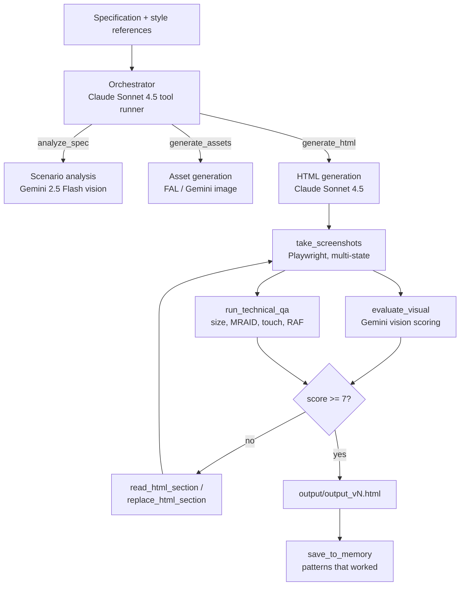

# Playable Ads Generator

Multi-agent pipeline that turns a written brief into a single self-contained HTML5
playable ad: it generates the missing art, writes the game, screenshots it, scores
it, and patches its own code until the result passes visual and technical QA.

Output is one HTML file with every image inlined as base64, wrapped for MRAID 3.0
so it can be uploaded to Unity Ads, AppLovin, IronSource, Mintegral and similar
networks.

See [`examples/car-wash-demo.html`](examples/car-wash-demo.html) for a generated result.

## How it works



The orchestrator is a single Claude agent driving ~18 tools
(`playable_agents/orchestrator.py`). Key properties:

- **Self-correcting loop** — screenshot, score, patch. Capped at 5 QA iterations
  or a visual score of 7/10, whichever comes first.
- **Section-level editing** — the HTML is patched through
  `read_html_section` / `replace_html_section` instead of being regenerated, so
  large base64 payloads never re-enter the model's output budget.
- **Versioned output** — every accepted patch is a new `output/output_vN.html`,
  with `rollback_html` and `get_version_history` available to the agent.
- **Server-side context management** — old tool results are cleared at 40K input
  tokens (`clear_tool_uses_20250919`), keeping long QA loops inside the context
  window.
- **Cross-run memory** — `search_memory` / `save_to_memory` persist what worked
  per genre in `memory/`.

### Models

| Stage | Model | Where |
|---|---|---|
| Orchestration, HTML generation | `claude-sonnet-4-5` | `playable_agents/orchestrator.py`, `generator_agent.py` |
| Scenario analysis, visual QA | `gemini-2.5-flash` | `services/gemini_client.py` |
| Asset generation | `fal-ai/gemini-25-flash-image`, `gemini-3-pro-image-preview` | `services/fal_imagen_client.py`, `services/imagen_client.py` |
| PDF brief extraction, image classification | `gpt-5.2` | `tools/pdf_tools.py`, `tools/image_tools.py` |

## Requirements

- Python 3.10+
- API keys: Anthropic, Google Gemini, FAL.AI, OpenAI (OpenAI only for the PDF/
  image-classification tools)
- Chromium for Playwright screenshots

## Setup

```bash
git clone https://github.com/v9833078908/playable-ads-HC.git
cd playable-ads-HC

python3 -m venv venv
source venv/bin/activate          # Windows: venv\Scripts\activate
pip install -r requirements.txt
playwright install chromium

cp .env.example .env              # then fill in your API keys
```

## Usage

```bash
# Generate from a brief, using reference art for style consistency
python run_pipeline.py spec.md --assets ./references

# Skip generation and only run the QA/improvement loop on output/output_v1.html
python run_pipeline.py spec.md --resume
```

The CLI prints the final HTML path, the number of QA iterations, and the visual
scores. Artifacts land in `output/` (HTML versions, extracted assets) and
`memory/` (learned patterns); both are git-ignored.

From Python:

```python
import asyncio
from playable_agents.orchestrator import run_orchestrator

result = asyncio.run(run_orchestrator(
    spec_text=open("spec.md").read(),
    reference_assets={"car.png": "data:image/png;base64,..."},  # optional
    output_dir="output",
))

print(result["html_path"], result["scores"], result["iterations"])
```

## Quality gates

`playable_agents/technical_qa_agent.py` enforces the checks ad networks actually
reject on:

- file size under the 5 MB budget
- `touchstart` / `touchmove` / `touchend` handlers, with mouse fallbacks
- MRAID presence: `window.mraid`, `mraid.open(storeUrl)`
- `requestAnimationFrame` game loop, no blocking timers
- viewport meta tag, `touch-action: none`, `user-scalable=no`
- valid, complete HTML structure (no truncated output)

`playable_agents/visual_qa_agent.py` scores screenshots on asset presence,
layout, physics, animation and completeness, averaged into a 0–10 visual score.

## Project layout

```
run_pipeline.py            CLI entrypoint for the v2 pipeline
playable_agents/
  orchestrator.py          Tool-runner agent + all pipeline tools
  scenario_agent.py        Brief and style-reference analysis (vision)
  asset_generator_agent.py Prompt writing + image generation via FAL
  generator_agent.py       HTML/CSS/JS generation
  visual_qa_agent.py       Screenshot scoring
  technical_qa_agent.py    Code and compliance checks
  html_file_manager.py     Versioned HTML storage, section read/replace
  memory_manager.py        Cross-run memory of successful patterns
  screenshot_tool.py       Playwright multi-state capture
  prompts/                 Agent system prompts and quality rubric
services/                  Gemini, FAL, Imagen and segmentation clients
tools/                     PDF parsing, image classification, HTML validation
models/                    Pydantic models (brief, assets, spec, validation)
frontend/templates/        Jinja2 playable templates
tests/                     Offline unit and integration tests (pytest)
scripts/                   Utilities; scripts/manual/ hits live APIs
legacy/                    v1 Streamlit UI, no longer runnable (see legacy/README.md)
docs/                      Architecture notes, plans, reports
examples/                  A generated playable ad
```

## Tests

```bash
python -m pytest            # 89 offline tests, no API calls
```

`scripts/manual/` holds exploratory scripts that call real APIs and cost money;
they are not part of the suite.

## Status and limitations

- **No UI.** The Streamlit app targeted the removed v1 orchestrator and is kept
  in `legacy/` for reference only; the CLI is the supported entrypoint.
- **Genre coverage.** The generation prompt is tuned for car-wash / cleaning
  mechanics (`playable_agents/prompts/generator_car_wash.md`). Other genres run
  through the same pipeline without genre-specific guidance.
- **Cost and runtime.** A full run makes dozens of model calls, including image
  generation and vision scoring; expect minutes, not seconds.
- **Rate limits.** The orchestrator paces itself for a 30K tokens/min tier and
  retries up to 10 times; tighter tiers will stall.

Historical design notes, plans and test reports live in [`docs/`](docs/);
`docs/KNOWN_ISSUES.md` and `docs/TODO_FIXES.md` describe issues from earlier
iterations and are not all current.

## License

MIT — see [LICENSE](LICENSE).
